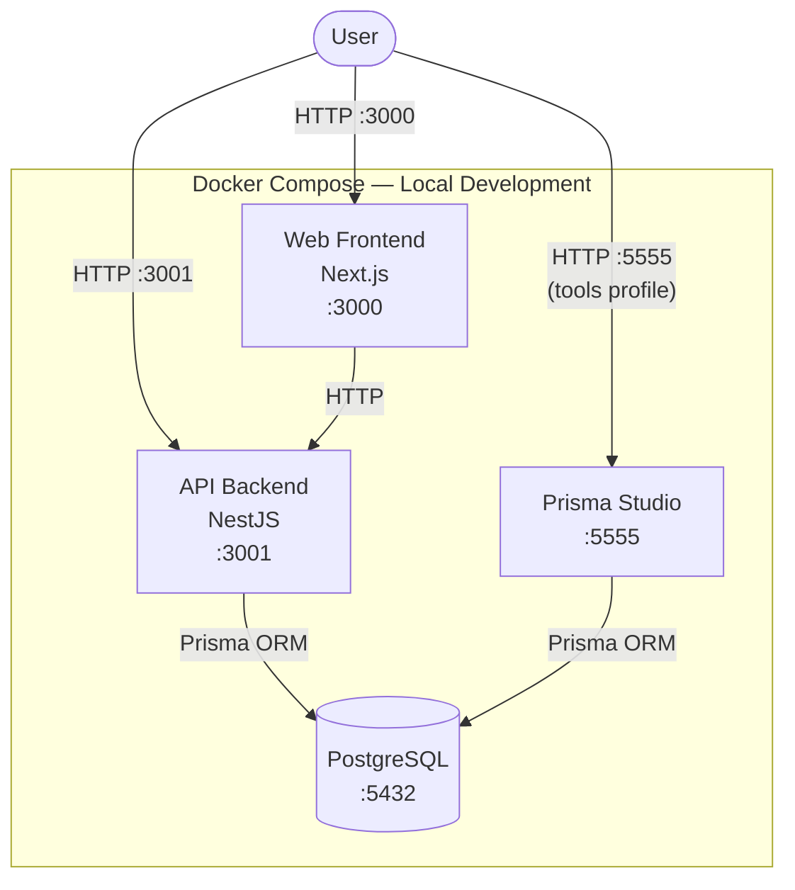
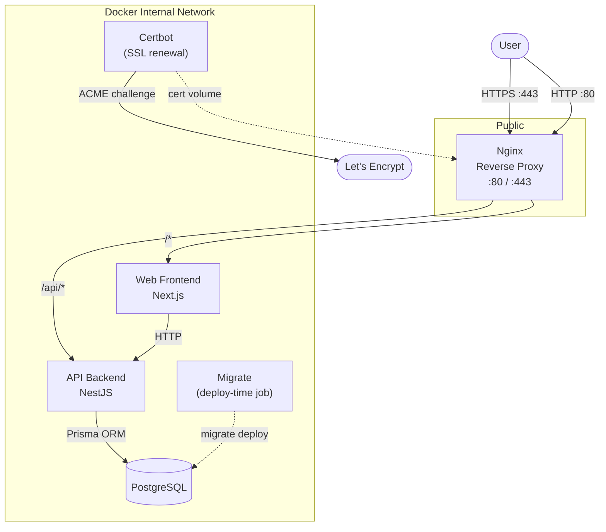

# FinFlow

FinFlow is a full-stack personal finance tracker built with Next.js, NestJS, and PostgreSQL. It solves the problem of scattered financial records by providing a secure, centralized platform to track income, categorize expenses, and analyze spending habits. Built for developers and privacy-conscious users, it ensures full ownership and control of your financial data without relying on third-party SaaS services.

<details>
<summary>Table of Contents</summary>

- [Architecture](#architecture)
  - [Local Development](#local-development)
  - [Production](#production)
- [Folder Structure](#folder-structure)
- [Setup Instructions](#setup-instructions)
  - [Initial Setup](#initial-setup)
  - [Dependency Management and State](#dependency-management-and-state)
  - [Destructive Operations and Hidden Fragilities](#destructive-operations-and-hidden-fragilities)
- [Local Production Smoke Test](#local-production-smoke-test)
  - [1. Set a Local API URL](#1-set-a-local-api-url)
  - [2. Bring the Stack Up](#2-bring-the-stack-up)
  - [3. Confirm Migrations Ran Cleanly](#3-confirm-migrations-ran-cleanly)
  - [4. Hit the Health Endpoint](#4-hit-the-health-endpoint)
  - [5. Seed and Smoke Test the App](#5-seed-and-smoke-test-the-app)
  - [6. Tear Down](#6-tear-down)
  - [7. Restore the Production URL Before Deploying](#7-restore-the-production-url-before-deploying)
- [Production Deployment](#production-deployment)
  - [Prerequisites](#prerequisites)
  - [1. Environment Variables](#1-environment-variables)
  - [2. Configure Nginx](#2-configure-nginx)
  - [3. Bootstrap SSL (first deployment only)](#3-bootstrap-ssl-first-deployment-only)
  - [4. Deploy](#4-deploy)
  - [5. Seed the Database (first deployment only)](#5-seed-the-database-first-deployment-only)
  - [Subsequent Deploys](#subsequent-deploys)
- [Design Decisions](#design-decisions)
- [API Reference](#api-reference)
  - [Interactive Documentation (Swagger)](#interactive-documentation-swagger)
  - [Base URL & Global Config](#base-url--global-config)
  - [Authentication](#authentication)
  - [Health](#health)
  - [Auth Endpoints](#auth-endpoints)
  - [Categories Endpoints](#categories-endpoints)
  - [Transactions Endpoints](#transactions-endpoints)
  - [Users Endpoints](#users-endpoints)
- [Testing](#testing)
  - [Unit Testing](#unit-testing)
  - [Integration (e2e) Testing](#integration-e2e-testing)

</details>

## Architecture

### Local Development



> **Note:** Prisma Studio is excluded from the default profile and must be started explicitly with `docker compose --profile tools up -d`.

### Production



> **Note:** The database and all application ports are never exposed to the host. Nginx is the sole public entry point. The `migrate` service runs once per deploy and exits — it is not a long-running process.

## Folder Structure

```
finance-tracker/
├── apps/
│   ├── api/          ← Nest.js Backend
│   └── web/          ← Next.js Frontend
├── docker-compose.yml
├── .env.example
└── README.md
```

## Setup Instructions

### Initial Setup

1. **Environment Variables**
   Create a `.env` file in the root directory by copying the provided example template:
   ```bash
   cp .env.example .env
   ```
   *(Update the `.env` values if necessary, especially secrets).*

2. **Start the Infrastructure**
   Build the Docker images and start the containers in detached mode:
   ```bash
   docker compose up -d --build
   ```

3. **Database Initialization**
   Apply the existing Prisma migrations to initialize the PostgreSQL database schema. Run this command inside the `api` container:
   ```bash
   docker compose exec api npx prisma migrate dev
   ```

4. **Seed the Database**
   Populate the database with initial categories and data. Run this command inside the `api` container:
   ```bash
   docker compose exec api npx prisma db seed
   ```

5. **Access the Application**
   - **Frontend:** [http://localhost:3000](http://localhost:3000)
   - **Backend API:** [http://localhost:3001/api/v1](http://localhost:3001/api/v1)
   - **API Documentation (Swagger):** [http://localhost:3001/api/v1/docs](http://localhost:3001/api/v1/docs)
   - **Prisma Studio (DB Admin):** To start Prisma studio, start docker compose with the tools profile (`docker compose --profile tools up -d`) and visit [http://localhost:5555](http://localhost:5555).

### Dependency Management and State

Our Docker architecture intentionally uses a bind mount for live code reloading alongside an anonymous volume (`/app/node_modules`). This anonymous volume protects the container's internal dependencies from being overwritten by the host machine's local environment. 

While this prevents OS-level binary conflicts, it creates a persistent state cache. If you modify `package.json`, the container will not automatically adopt the new dependencies upon a standard restart. It will continue to use the stale anonymous volume.

To safely introduce new packages without tearing down the infrastructure, use real-time injection. Execute the installation directly inside the running container. This updates the internal volume and immediately syncs the updated `package.json` back to your host machine without requiring a restart:

```bash
# Example: Installing a package in the API container
docker compose exec api npm install <package-name>
```

If you pull upstream changes where multiple dependencies have been altered, a targeted rebuild is the most robust approach. This forces Docker to recreate the specific container and explicitly discard its isolated dependency volume, while preserving all other system state:

```bash
# Rebuilds the API container and recreates its anonymous volumes
docker compose up -d --build -V api
```

### Destructive Operations and Hidden Fragilities

When spinning down the environment, exercise extreme caution regarding volume destruction.

```bash
# Safely stops and removes containers
docker compose down
```

**Critical Warning:** Executing `docker compose down -v` is a nuclear option. The `-v` flag destroys all volumes declared in the Docker configuration, including the persistent `postgres_data` volume. Running this command will permanently wipe your local development database. 

Always rely on the targeted `-V` rebuild method detailed above to manage stale dependency state, rather than destroying the entire environment infrastructure to fix a local package issue.

## Local Production Smoke Test

Before deploying to your VPS, you can run the full production stack locally to verify that the production images build correctly, migrations run cleanly, and the application works end-to-end — all without needing a domain name or SSL certificates.

A `docker-compose.test.yml` override is provided for this purpose. It layers on top of `docker-compose.prod.yml`, using the exact same Dockerfiles and service wiring, but exposes the application ports directly to the host and disables Nginx and Certbot.

### 1. Set a Local API URL

`NEXT_PUBLIC_API_URL` is baked into the Next.js bundle at build time. Temporarily point it at the locally exposed API port:

```
NEXT_PUBLIC_API_URL=http://localhost:3001
```

### 2. Bring the Stack Up

```bash
docker compose -f docker-compose.prod.yml -f docker-compose.test.yml up -d --build
```

This builds the production images from scratch and starts services in the correct order: `db` (healthy) → `migrate` (completes) → `api` → `web`.

### 3. Confirm Migrations Ran Cleanly

```bash
docker compose -f docker-compose.prod.yml -f docker-compose.test.yml logs migrate
```

Prisma will report which migrations were applied. The service should exit with no errors.

### 4. Hit the Health Endpoint

The health controller pings the database through Prisma, so a `200` response confirms both the API build and the database connection are working:

```bash
curl http://localhost:3001/api/v1/health
```

Expected response:

```json
{"status":"ok","info":{"database":{"status":"up"}},"error":{},"details":{"database":{"status":"up"}}}
```

### 5. Seed and Smoke Test the App

```bash
docker compose -f docker-compose.prod.yml -f docker-compose.test.yml run --rm migrate npx prisma db seed
```

Then open [http://localhost:3000](http://localhost:3000) and run through the full user flow — log in, create a transaction, check the dashboard. This exercises the API, database, and frontend all at once.

### 6. Tear Down

```bash
# Stops containers, preserves the postgres_data volume
docker compose -f docker-compose.prod.yml -f docker-compose.test.yml down
```

### 7. Restore the Production URL Before Deploying

Switch `NEXT_PUBLIC_API_URL` back to your real domain before pushing to the VPS. The images are rebuilt on the VPS during deployment, so the correct URL will be baked in at that point:

```
NEXT_PUBLIC_API_URL=https://yourdomain.com
```

## Production Deployment

The production stack is defined in `docker-compose.prod.yml` and uses Nginx as a reverse proxy with HTTPS via Let's Encrypt. All application ports are internal-only — the only public entry point is Nginx on ports `80` and `443`.

### Prerequisites

- A VPS with Docker and Docker Compose installed
- A domain name with an `A` record pointing to your VPS IP address
- Ports `80` and `443` open on your VPS firewall

### 1. Environment Variables

Copy the example template and fill in **production** values, paying close attention to secrets:

```bash
cp .env.example .env
```

Set `NEXT_PUBLIC_API_URL` to your domain. This value is baked into the Next.js bundle at build time, so it must be correct before you build the images:

```
NEXT_PUBLIC_API_URL=https://yourdomain.com
```

### 2. Configure Nginx

Open `nginx/nginx.conf` and replace every occurrence of `YOUR_DOMAIN` with your actual domain name. There are three occurrences — two `server_name` directives and two SSL certificate paths.

### 3. Bootstrap SSL (first deployment only)

Before starting the full stack, obtain your initial Let's Encrypt certificate. This uses Certbot's standalone mode, which temporarily binds port `80` itself — so **nothing else should be running on that port** at this point:

```bash
docker run --rm \
  -p 80:80 \
  -v "./nginx/certbot/conf:/etc/letsencrypt" \
  -v "./nginx/certbot/www:/var/www/certbot" \
  certbot/certbot certonly --standalone \
  --email you@example.com \
  -d yourdomain.com \
  --agree-tos \
  --no-eff-email
```

Once the command completes, the certificate will be in `nginx/certbot/conf/live/yourdomain.com/`. Nginx is configured to read it from there automatically.

### 4. Deploy

Build the production images and start all services in detached mode:

```bash
docker compose -f docker-compose.prod.yml up -d --build
```

The startup order is enforced automatically: the database must pass its healthcheck before migrations run, and the API container will not start until the `migrate` service exits successfully.

### 5. Seed the Database (first deployment only)

Populate the database with initial categories and data. The `migrate` service image already has all the required tooling:

```bash
docker compose -f docker-compose.prod.yml run --rm migrate npx prisma db seed
```

### Subsequent Deploys

After pulling new changes, rebuild and restart the stack with the same command used in step 4:

```bash
docker compose -f docker-compose.prod.yml up -d --build
```

The `migrate` service re-runs automatically on every deploy, applying any pending migrations before the API restarts. SSL certificates are renewed automatically by the `certbot` service, which wakes up every 12 hours and runs `certbot renew`.

## Design Decisions

- **Monorepo-style structure:** The project is divided into an `api` (backend) and `web` (frontend) directory to keep the full stack co-located while separating concerns and allowing shared typings/configurations if needed.
- **Dockerized Development:** We rely heavily on Docker Compose to guarantee environment parity and isolate dependencies. This simplifies onboarding but necessitates strict dependency management workflows.
- **Modular Architecture vs. DDD:** The API follows a modular layered architecture (Controller → Service → Repository), organized by feature slice rather than by layer. Domain-Driven Design was considered and deliberately set aside: DDD's full apparatus — aggregates, domain events, and bounded contexts — exists to manage domains where the business logic itself is the hard problem. A personal finance tracker doesn't have that problem. Its complexity lies in the plumbing, not the domain rules. Applying DDD here would have introduced significant ceremony with no corresponding reduction in complexity, a pattern sometimes called "architecture astronomy." The design borrows selectively from DDD's tactical patterns — the repository abstraction, strict DTO boundaries, and domain-aligned naming — while keeping the overall structure simple, readable, and proportionate to the problem. Each feature module is fully self-contained, making it easy to locate, modify, and test in isolation.
- **Next.js App Router:** The frontend utilizes the Next.js App Router for optimized server-side rendering and streamlined layouts, paired with Tailwind CSS and accessible UI primitives for rapid component development.

## API Reference

### Interactive Documentation (Swagger)

The API is fully documented using Swagger (OpenAPI 3.0). You can explore, test, and interact with the endpoints directly from your browser:

- **Local Development:** [http://localhost:3001/api/v1/docs](http://localhost:3001/api/v1/docs)
- **Production:** `https://yourdomain.com/api/v1/docs`

The Swagger UI provides the complete schema for all requests and responses, as well as built-in support for JWT Authentication and Cookie-based Refresh Token handling.

### Base URL & Global Config

All endpoints are served under the `/api/v1` global prefix.

| Property | Value |
|---|---|
| **Base path** | `/api/v1` |
| **CORS** | Credentials enabled; origin controlled by the `FRONTEND_URL` env var (default: `http://localhost:3000`) |
| **Cookie parser** | Enabled globally — required for refresh token handling |

---

### Authentication

The API uses a two-token strategy: a short-lived JWT access token and a long-lived httpOnly cookie refresh token.

| Guard | How to provide | Token lifetime |
|---|---|---|
| `JwtAuthGuard` | `Authorization: Bearer <accessToken>` header | 15 minutes |
| `JwtRefreshGuard` | `refresh_token` httpOnly cookie (auto-sent by browser) | 7 days |

The refresh token cookie is path-scoped to `/api/v1/auth`, so it is only transmitted on requests to that sub-path. All non-public endpoints that use `JwtAuthGuard` will return `401 Unauthorized` if the header is missing or the token is expired.

---

### Health

#### `GET /api/v1/health`

Public. Pings the database through Prisma and returns the service health status.

**Response `200 OK`:**
```finflow/README.md#L1-1
{"status":"ok","info":{"database":{"status":"up"}},"error":{},"details":{"database":{"status":"up"}}}
```

Returns `503 Service Unavailable` if the database is unreachable.

---

### Auth Endpoints

#### `POST /api/v1/auth/register`

Public. Creates a new user account and seeds a set of default categories for them. Sets a `refresh_token` httpOnly cookie on success.

**Request body:**

| Field | Type | Required | Constraints |
|---|---|---|---|
| `email` | string | Yes | Valid email; normalized to lowercase |
| `password` | string | Yes | Min 8 characters |

**Response `201 Created`:**

| Field | Type | Description |
|---|---|---|
| `accessToken` | string | JWT access token, 15-minute lifetime |

**Errors:** `409 Conflict` — email already registered. `400 Bad Request` — validation failure.

---

#### `POST /api/v1/auth/login`

Public. Authenticates an existing user. Sets a `refresh_token` httpOnly cookie on success.

**Request body:**

| Field | Type | Required | Constraints |
|---|---|---|---|
| `email` | string | Yes | Valid email; normalized to lowercase |
| `password` | string | Yes | — |

**Response `200 OK`:** Same `{ accessToken }` shape as register.

**Errors:** `401 Unauthorized` — wrong email or password. A constant-time dummy hash comparison prevents email enumeration via timing attacks.

---

#### `POST /api/v1/auth/refresh`

Requires `JwtRefreshGuard` (reads the `refresh_token` cookie). Issues a new access token and rotates the refresh token. If the stored hash doesn't match, all sessions are immediately invalidated.

**Request body:** None.

**Response `200 OK`:** `{ accessToken }` — new access token plus a rotated `refresh_token` cookie.

**Errors:** `401 Unauthorized` — missing, expired, or already-used refresh token.

---

#### `POST /api/v1/auth/logout`

Requires `JwtAuthGuard`. Clears the `refresh_token` cookie and invalidates the refresh token in the database.

**Request body:** None. **Response:** `204 No Content`.

**Errors:** `401 Unauthorized` — missing or invalid access token.

---

### Categories Endpoints

All category endpoints require `JwtAuthGuard`. Every operation is automatically scoped to the authenticated user — it is not possible to read or modify another user's categories.

#### `GET /api/v1/categories`

Returns all categories belonging to the current user.

**Response `200 OK`:** Array of `Category` objects.

---

#### `POST /api/v1/categories`

Creates a new category for the current user.

**Request body:**

| Field | Type | Required | Constraints |
|---|---|---|---|
| `name` | string | Yes | Max 50 characters |
| `icon` | string | No | Max 10 characters (e.g. an emoji) |

**Response `201 Created`:** The created `Category` object.

---

#### `PATCH /api/v1/categories/:id`

Updates an existing category. `:id` must be a valid UUID.

**Request body** (all fields optional):

| Field | Type | Constraints |
|---|---|---|
| `name` | string | Max 50 characters |
| `icon` | string | Max 10 characters |

**Response `200 OK`:** The updated `Category` object.

**Errors:** `400 Bad Request` — invalid UUID. `404 Not Found` — category not found or does not belong to the user.

---

#### `DELETE /api/v1/categories/:id`

Deletes a category. `:id` must be a valid UUID.

**Response `204 No Content`.**

**Errors:** `400 Bad Request` — invalid UUID. `404 Not Found` — category not found or does not belong to the user.

---

### Transactions Endpoints

All transaction endpoints require `JwtAuthGuard`. All operations are scoped to the authenticated user.

#### `GET /api/v1/transactions`

Returns a paginated list of the current user's transactions, with optional filters.

**Query parameters** (all optional):

| Parameter | Type | Description |
|---|---|---|
| `month` | string | Filter by calendar month — format `YYYY-MM` (e.g. `2024-01`) |
| `categoryId` | string (UUID) | Filter to a single category |
| `type` | `INCOME` \| `EXPENSE` | Filter by transaction type |
| `page` | integer >= 1 | Page number; default `1` |
| `limit` | integer 1–100 | Results per page; default `20` |

**Response `200 OK`:** Paginated array of `Transaction` objects.

---

#### `GET /api/v1/transactions/:id`

Returns a single transaction by ID. `:id` must be a valid UUID.

**Response `200 OK`:** A single `Transaction` object.

**Errors:** `400 Bad Request` — invalid UUID. `404 Not Found` — transaction not found or does not belong to the user.

---

#### `POST /api/v1/transactions`

Creates a new transaction.

**Request body:**

| Field | Type | Required | Constraints |
|---|---|---|---|
| `amount` | number | Yes | Positive; max 2 decimal places; max `999,999,999.99` |
| `type` | `INCOME` \| `EXPENSE` | Yes | — |
| `date` | string | Yes | ISO 8601 date string (e.g. `"2024-06-01"`) |
| `categoryId` | string (UUID) | Yes | Must belong to the authenticated user |
| `description` | string | No | Max 255 characters |

**Response `201 Created`:** The created `Transaction` object.

---

#### `PATCH /api/v1/transactions/:id`

Updates an existing transaction. `:id` must be a valid UUID.

**Request body** (all fields optional):

| Field | Type | Constraints |
|---|---|---|
| `amount` | number | Positive; max 2 decimal places; max `999,999,999.99` |
| `type` | `INCOME` \| `EXPENSE` | — |
| `date` | string | ISO 8601 date string |
| `categoryId` | string (UUID) | Must belong to the authenticated user |
| `description` | string | Max 255 characters |

**Response `200 OK`:** The updated `Transaction` object.

**Errors:** `400 Bad Request` — invalid UUID or validation failure. `404 Not Found` — transaction not found or does not belong to the user.

---

#### `DELETE /api/v1/transactions/:id`

Deletes a transaction. `:id` must be a valid UUID.

**Response `204 No Content`.**

**Errors:** `400 Bad Request` — invalid UUID. `404 Not Found` — transaction not found or does not belong to the user.

---

### Users Endpoints

All user endpoints require `JwtAuthGuard`. There are no `:id` parameters — users can only ever operate on their own account via `/me`.

#### `GET /api/v1/users/me`

Returns the profile of the current user. Sensitive fields (`passwordHash`, `refreshTokenHash`) are never included in the response.

**Response `200 OK`:**

| Field | Type |
|---|---|
| `id` | string (UUID) |
| `email` | string |

---

#### `PATCH /api/v1/users/me`

Updates the current user's profile.

**Request body** (all fields optional):

| Field | Type | Constraints |
|---|---|---|
| `email` | string | Valid email; normalized to lowercase |

**Response `200 OK`:** Updated user profile (same shape as `GET /users/me`).

---

#### `PATCH /api/v1/users/me/password`

Changes the current user's password. As a security measure, this invalidates all active refresh tokens, forcing re-authentication on all devices.

**Request body:**

| Field | Type | Required | Constraints |
|---|---|---|---|
| `currentPassword` | string | Yes | Must match the stored bcrypt hash |
| `newPassword` | string | Yes | Min 8 characters |

**Response `204 No Content`.**

**Errors:** `401 Unauthorized` — `currentPassword` does not match.

---

#### `DELETE /api/v1/users/me`

Permanently deletes the authenticated user's account. Cascades to all their transactions and categories at the database level.

**Request body:** None. **Response:** `204 No Content`.

---

### Endpoint Summary

| Method | Path | Auth | Description |
|---|---|---|---|
| `GET` | `/api/v1/health` | Public | Service & database health check |
| `POST` | `/api/v1/auth/register` | Public | Register a new account |
| `POST` | `/api/v1/auth/login` | Public | Log in and receive tokens |
| `POST` | `/api/v1/auth/refresh` | Cookie | Rotate refresh token, get new access token |
| `POST` | `/api/v1/auth/logout` | Bearer | Invalidate session |
| `GET` | `/api/v1/categories` | Bearer | List all categories |
| `POST` | `/api/v1/categories` | Bearer | Create a category |
| `PATCH` | `/api/v1/categories/:id` | Bearer | Update a category |
| `DELETE` | `/api/v1/categories/:id` | Bearer | Delete a category |
| `GET` | `/api/v1/transactions` | Bearer | List transactions (paginated, filterable) |
| `GET` | `/api/v1/transactions/:id` | Bearer | Get a single transaction |
| `POST` | `/api/v1/transactions` | Bearer | Create a transaction |
| `PATCH` | `/api/v1/transactions/:id` | Bearer | Update a transaction |
| `DELETE` | `/api/v1/transactions/:id` | Bearer | Delete a transaction |
| `GET` | `/api/v1/users/me` | Bearer | Get current user profile |
| `PATCH` | `/api/v1/users/me` | Bearer | Update current user profile |
| `PATCH` | `/api/v1/users/me/password` | Bearer | Change password (invalidates all sessions) |
| `DELETE` | `/api/v1/users/me` | Bearer | Permanently delete account (cascade) |

---

## Testing

The project includes unit and integration tests covering the core domain. The backend API maintains ~88% statement coverage, specifically focusing on the controller and service layers where core business logic resides.

### Unit Testing

Unit tests are co-located with their respective modules (often inside `__tests__` directories or ending in `.spec.ts`). They focus on testing individual services, controllers, and utilities in isolation, typically mocking external dependencies such as the database.

To run the unit tests:

```bash
cd apps/api
npm run test
```

To run unit tests in watch mode during development:

```bash
npm run test:watch
```

To run unit tests with coverage reporting:

```bash
npm run test:cov
```

### Integration (e2e) Testing

End-to-end (e2e) integration tests validate the full request-response lifecycle of the API, including database interactions. They are located in the `apps/api/test/` directory.

These tests hit a real PostgreSQL database to ensure that queries, module wiring, validation, and serialization all work correctly together.

**Note:** The e2e tests require access to the environment variables and the database network. You must run them directly inside the `api` container while the Docker Compose environment is running. Be aware that the tests will clear the database before each suite to ensure a clean state.

To run the e2e tests:

```bash
docker compose exec api npm run test:e2e
```